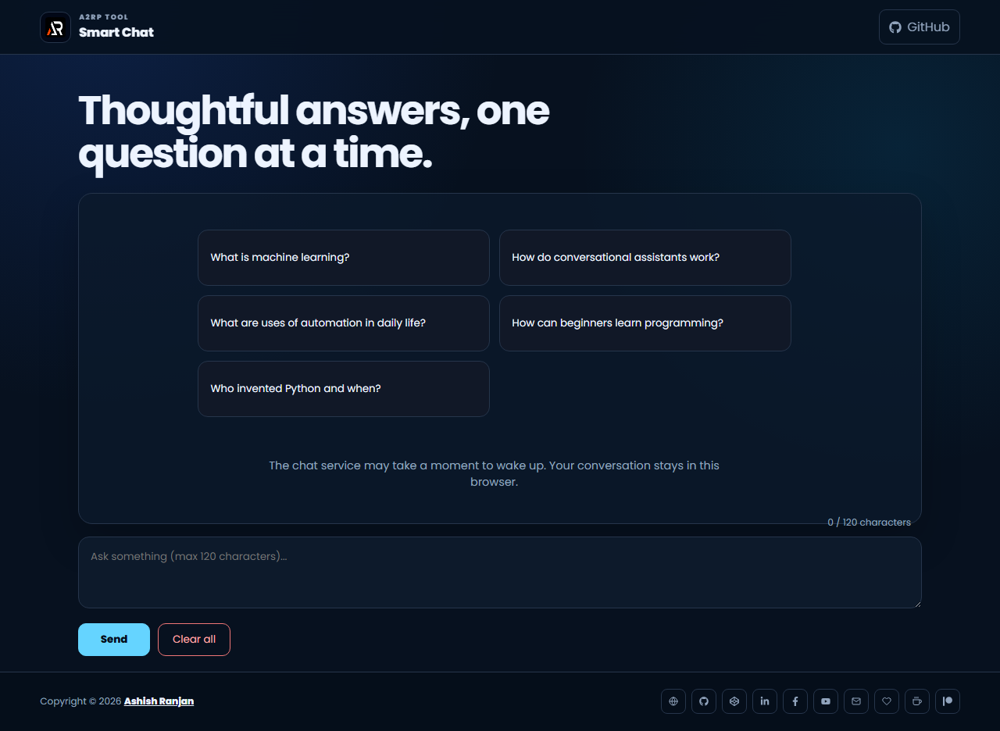

# Smart Chat Frontend

A focused React chat interface with sample questions, conversation history, delete and clear actions, responsive layout, and local browser persistence.



## Features

- Sample questions and custom prompts
- Conversation history saved in localStorage
- Delete one conversation or clear all with confirmation
- Responsive fixed header, accessible controls, icon-only footer, and go-to-top button
- Toast feedback and loading states for the connected chat service

## Tech stack

React, Vite, styled-components, Material UI, React Icons, and React Toastify.

## Run locally

```bash
npm install
npm run dev
```

The local frontend expects the chat service at `http://localhost:1198`. The deployed frontend uses the configured hosted service endpoint.

## Build and deploy

```bash
npm run lint
npm run build
npm run deploy
```

Live demo: [a2rp.github.io/gemini-chat-frontend](https://a2rp.github.io/gemini-chat-frontend/)

## Links

- Portfolio: [https://www.ashishranjan.net](https://www.ashishranjan.net)
- GitHub: [https://github.com/a2rp](https://github.com/a2rp)
- CodePen: [https://codepen.io/ash1198](https://codepen.io/ash1198)
- LinkedIn: [https://www.linkedin.com/in/aashishranjan](https://www.linkedin.com/in/aashishranjan)
- Facebook: [https://www.facebook.com/theash.ashish/](https://www.facebook.com/theash.ashish/)
- YouTube: [https://www.youtube.com/@ashishranjan-ashz?sub_confirmation=1](https://www.youtube.com/@ashishranjan-ashz?sub_confirmation=1)
- Email: [ash.ranjan09@gmail.com](mailto:ash.ranjan09@gmail.com)

## Support

- Support: [https://a2rp-donation-page.netlify.app/](https://a2rp-donation-page.netlify.app/)
- Buy Me a Coffee: [https://buymeacoffee.com/a2rp](https://buymeacoffee.com/a2rp)
- Patreon: [https://patreon.com/a2rp](https://patreon.com/a2rp)
